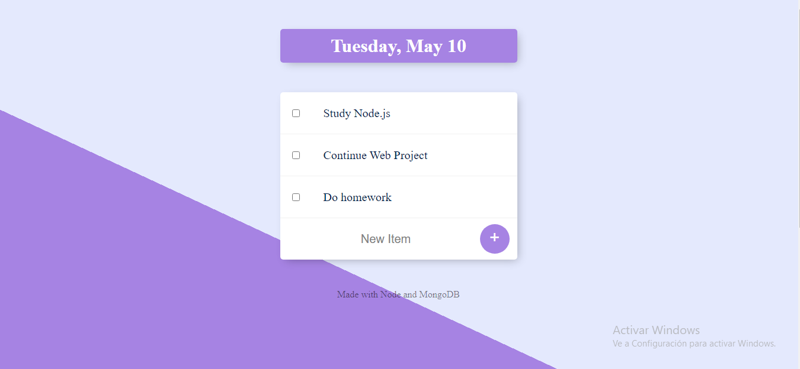

# TodoList
TodoList with Node and MongoDB

### Descripción
Permite crear notas, estas se guarda en una colección en MongoDB, a su vez estas notas pueden ser eliminadas seleccionando el checkbox continuo a cada nota.
Si todas las notas son eliminadas, se restableceran las primeras 3 notas por defecto.
Esta aplicación tambien utiliza ejs para interactuar con el DOM.

### Como utilizar
La apliacion en node se ejecuta a partir del archivo app.js, a su vez la aplicación intentara conectarse a una instancia local de MongoDB.

***

